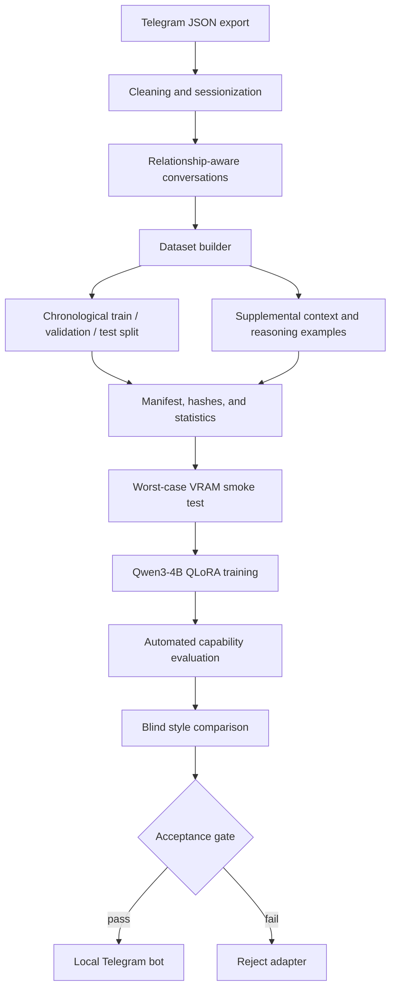

<div align="center">

# Personal Telegram AI

### A privacy-first, end-to-end LLM personalization pipeline

Fine-tune **Qwen3-4B** with **4-bit QLoRA** on private Telegram conversations, verify that the adapter preserves context and reasoning, and serve it locally through a production-minded Telegram bot.

[](https://www.python.org/)
[](https://pytorch.org/)
[](https://huggingface.co/docs/transformers/)
[](https://huggingface.co/docs/peft/)
[](https://docs.aiogram.dev/)
[](https://docs.pytest.org/)
[](https://docs.astral.sh/ruff/)
[](#license)

**Local-first · Reproducible · Leakage-aware · VRAM-constrained · Evaluation-gated**

</div>

---

## Why this project stands out

This repository is not just a fine-tuning script. It implements the full lifecycle of a local personalization system:

- cleans and sessionizes raw Telegram exports;
- builds leakage-resistant chronological train, validation, and test splits;
- trains a 4B-parameter model using memory-efficient QLoRA;
- masks prompt tokens so loss is computed only on the target reply;
- runs a worst-case VRAM smoke test before full training;
- records dataset hashes, environment metadata, selected LoRA modules, and peak VRAM;
- compares the adapter against the base model on context retention, reasoning, and instructions;
- performs blind style evaluation before accepting the adapter;
- deploys the accepted adapter through a local Telegram bot with async inference control.

## What this demonstrates

For an internship or junior ML/software role, the project demonstrates practical experience with:

| Area | Evidence in this repository |
|---|---|
| LLM fine-tuning | QLoRA, PEFT, NF4 quantization, BF16 compute, gradient checkpointing |
| Data engineering | Telegram export cleaning, sessionization, deterministic dataset generation |
| ML evaluation | Base-vs-adapter comparisons, style review, context and reasoning checks |
| Reproducibility | Dataset hashes, environment capture, checkpoint validation, fixed seeds |
| GPU optimization | 4-bit loading, bounded sequence length, gradient accumulation, VRAM smoke gate |
| Software engineering | Typed configuration, CLI commands, tests, linting, modular package structure |
| Applied deployment | aiogram bot, SQLite state, bounded context, queued local inference |
| Privacy engineering | Local execution, ignored private artifacts, sanitized public configuration |

## Architecture



## Technology stack

<div align="center">


&nbsp;&nbsp;

&nbsp;&nbsp;

&nbsp;&nbsp;

&nbsp;&nbsp;


</div>

| Layer | Technologies |
|---|---|
| Language | Python 3.11 |
| Model | Qwen/Qwen3-4B-Instruct-2507 |
| Training | PyTorch, Transformers, TRL, PEFT, Accelerate |
| Quantization | bitsandbytes, 4-bit NF4, double quantization, BF16 |
| Data | Hugging Face Datasets, JSONL, YAML, Jinja2 |
| Validation | Pydantic |
| CLI | Typer |
| Bot | aiogram |
| Storage | SQLite |
| Quality | pytest, Ruff |

## Core engineering decisions

### Memory-efficient fine-tuning

The base model is loaded in 4-bit NF4 with double quantization and BF16 compute. LoRA adapters are attached to attention and MLP projections:

```text
q_proj, k_proj, v_proj, o_proj,
gate_proj, up_proj, down_proj
```

Default adapter settings:

```yaml
rank: 16
alpha: 32
dropout: 0.05
learning_rate: 0.0002
micro_batch_size: 1
gradient_accumulation_steps: 16
sequence_length: 1024
```

### Leakage-resistant splitting

Complete conversation sessions are split chronologically rather than shuffling individual messages. This prevents fragments from the same conversation from appearing in both training and evaluation data.

### Target-only loss

Prompt tokens are assigned label `-100`, so the model is optimized only on the final owner reply instead of learning to reproduce the entire conversation prompt.

### Capability-preservation data

Personal style examples are supplemented with deterministic context-retention, reasoning, and instruction-following examples to reduce catastrophic behavioral regression.

### Acceptance gate

An adapter is accepted only after it:

1. comes from a complete training run;
2. matches the prepared dataset hash;
3. has verified VRAM metadata;
4. does not regress below the base model on automated checks;
5. reaches the configured blind style preference threshold.

## Repository structure

```text
.
├── bot.py                         # Local Telegram bot and inference queue
├── clean_telegram_export.py       # Export cleaning and sessionization
├── config.example.yaml            # Sanitized pipeline configuration
├── relationships.example.json     # Example relationship mapping
├── requirements-windows-cuda.txt  # Reproducible Windows/CUDA environment
├── WINDOWS_TRAINING.md            # Detailed Windows training guide
├── src/personal_ai/
│   ├── cli.py                     # prepare-data, train, evaluate commands
│   ├── config.py                  # Strict validated configuration models
│   ├── data.py                    # Dataset construction and split logic
│   ├── evaluation.py              # Capability and style evaluation gates
│   ├── modeling.py                # Quantized loading and generation
│   ├── supplemental.py            # Capability-preservation examples
│   ├── training.py                # QLoRA training and checkpoint safety
│   └── utils.py                   # Shared utilities
└── tests/                         # Dataset, modeling, training, and bot tests
```

## Quick start

### 1. Create the environment

```powershell
py -3.11 -m venv .venv
.\.venv\Scripts\Activate.ps1
python -m pip install --upgrade pip
pip install -r requirements-windows-cuda.txt
```

Verify CUDA:

```powershell
python -c "import torch; assert torch.cuda.is_available(); print(torch.__version__, torch.version.cuda, torch.cuda.get_device_name(0))"
```

### 2. Create private local configuration

```powershell
Copy-Item config.example.yaml config.yaml
Copy-Item relationships.example.json private_data/relationships.json
Copy-Item .env.example .env
```

Then update the private files with your own Telegram export identifier, data paths, relationship mapping, and bot token.

### 3. Prepare the dataset

```powershell
python clean_telegram_export.py
personal-ai prepare-data
```

### 4. Run the VRAM smoke test

```powershell
personal-ai train --smoke --fresh
```

A full run is blocked until the smoke test verifies that the model and worst-case examples fit within the configured VRAM limit.

### 5. Train

```powershell
personal-ai train
```

Other supported modes:

```powershell
personal-ai train --fresh
personal-ai train --resume last
```

### 6. Evaluate

```powershell
personal-ai evaluate
```

Evaluation covers delayed context recall, corrected-state recall, persistent instructions, reasoning, multilingual examples, and held-out personal style.

### 7. Launch the bot

```powershell
python bot.py
```

## Telegram bot behavior

The bot:

- loads the quantized base model and adapter once;
- serializes GPU generation through an async queue;
- keeps bounded per-chat history;
- batches rapidly arriving messages;
- converts unsupported media into stable text placeholders;
- conditions responses on the selected relationship type;
- stores lightweight state in SQLite;
- refuses an unaccepted adapter unless explicitly overridden.

Supported commands:

```text
/start
/style
/delete
/about
```

## Testing and code quality

```powershell
pip install -e .[dev]
pytest
ruff check .
```

The test suite covers dataset determinism, session isolation, prompt truncation, target-only loss masking, checkpoint selection, generation settings, adapter-dataset matching, evaluation behavior, and bot media handling.

## Privacy and responsible use

Telegram exports can contain credentials, phone numbers, locations, private conversations, and information about third parties.

Never commit:

- raw Telegram exports;
- generated datasets;
- adapters or checkpoints;
- evaluation samples;
- SQLite databases;
- `.env` or `config.yaml`;
- private relationship mappings.

Obtain appropriate consent before training on another person's messages. The bot should identify itself as an AI representation and should never be presented as the real person.

## Roadmap

- [x] Telegram export cleaning and sessionization
- [x] Relationship-conditioned dataset preparation
- [x] QLoRA training pipeline
- [x] VRAM smoke gate
- [x] Reproducibility metadata
- [x] Automated base-vs-adapter evaluation
- [x] Blind style acceptance gate
- [x] Local Telegram bot
- [ ] Retrieval-augmented long-term memory
- [ ] Automated CI workflow
- [ ] Portable inference API
- [ ] Evaluation dashboard

## Current status

The repository implements a complete experimental pipeline with safeguards for data leakage, reproducibility, VRAM limits, checkpoint integrity, capability regression, and style validation. Retrieval configuration is present for future work; the current bot uses bounded in-memory conversation history.

## License

No open-source license has been selected yet. Until a license is added, the source code remains available for viewing but is not automatically licensed for reuse.
